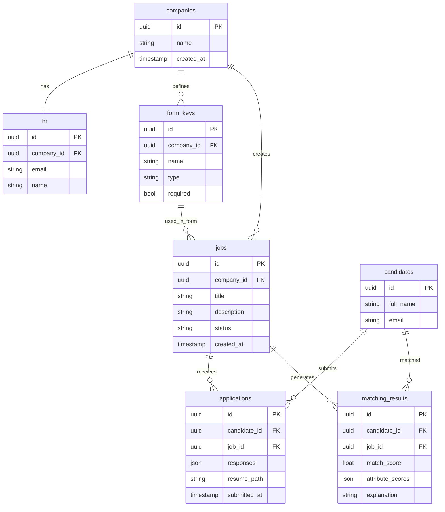

```mermaid
erDiagram

    %% Relationships
    companies ||--|| hr : has
    companies ||--o{ form_keys : defines
    companies ||--o{ jobs : creates
    jobs ||--o{ applications : receives
    form_keys ||--o{ jobs : used_in_form
    candidates ||--o{ applications : submits
    candidates ||--o{ matching_results : matched
    jobs ||--o{ matching_results : generates

    %% Entities
    companies {
        uuid id PK
        string name
        timestamp created_at
    }

    hr {
        uuid id PK
        uuid company_id FK
        string email
        string name
    }

    form_keys {
        uuid id PK
        uuid company_id FK
        string name
        string type
        bool required
    }

    jobs {
        uuid id PK
        uuid company_id FK
        string title
        string description
        string status
        timestamp created_at
    }

    candidates {
        uuid id PK
        string full_name
        string email
    }

    applications {
        uuid id PK
        uuid candidate_id FK
        uuid job_id FK
        json responses
        string resume_path
        timestamp submitted_at
    }

    matching_results {
        uuid id PK
        uuid candidate_id FK
        uuid job_id FK
        float match_score
        json attribute_scores
        string explanation
    }
```