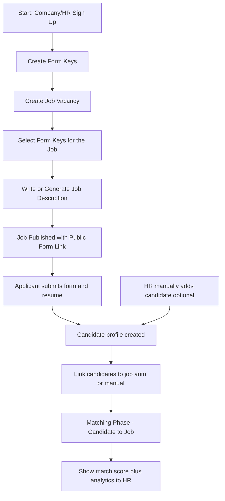

```mermaid
flowchart TD
    A[Start: Company/HR Sign Up]
    B[Create Form Keys]
    C[Create Job Vacancy]
    D1[Select Form Keys for the Job]
    D2[Write or Generate Job Description]
    E[Job Published with Public Form Link]
    F1[Applicant submits form and resume]
    F2[Candidate profile created]
    G[HR manually adds candidate optional]
    H[Link candidates to job auto or manual]
    I[Matching Phase - Candidate to Job]
    J[Show match score plus analytics to HR]

    A --> B
    B --> C
    C --> D1 --> D2 --> E
    E --> F1 --> F2
    G --> F2
    F2 --> H
    H --> I
    I --> J
```