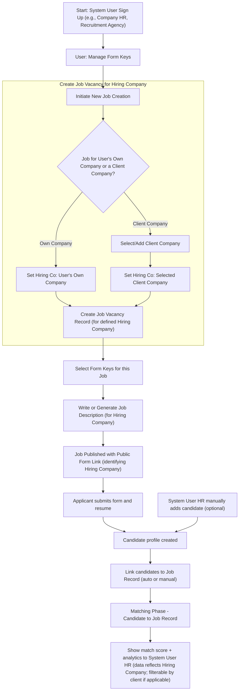

```mermaid
flowchart TD
    A["Start: System User Sign Up (e.g., Company HR, Recruitment Agency)"]
    B["User: Manage Form Keys"]

    subgraph "Create Job Vacancy for Hiring Company"
        direction TB
        C0["Initiate New Job Creation"]
        C1_Decision{"Job for User's Own Company or a Client Company?"}
        
        C1_Decision -- "Own Company" --> C2_Own["Set Hiring Co: User's Own Company"]
        C1_Decision -- "Client Company" --> C2_Client_Mgmt["Select/Add Client Company"]
        
        C2_Client_Mgmt --> C3_Client["Set Hiring Co: Selected Client Company"]
        
        C_JobRecord["Create Job Vacancy Record (for defined Hiring Company)"]
        
        C2_Own --> C_JobRecord
        C3_Client --> C_JobRecord
    end

    D1["Select Form Keys for this Job"]
    D2["Write or Generate Job Description (for Hiring Company)"]
    E["Job Published with Public Form Link (identifying Hiring Company)"]
    
    F1["Applicant submits form and resume"]
    F2["Candidate profile created"]
    G["System User HR manually adds candidate (optional)"]
    
    H["Link candidates to Job Record (auto or manual)"]
    I["Matching Phase - Candidate to Job Record"]
    J["Show match score + analytics to System User HR (data reflects Hiring Company; filterable by client if applicable)"]

    A --> B
    B --> C0
    C0 --> C1_Decision
    
    C_JobRecord --> D1
    D1 --> D2
    D2 --> E
    
    E --> F1
    F1 --> F2
    G --> F2
    F2 --> H
    H --> I
    I --> J
```